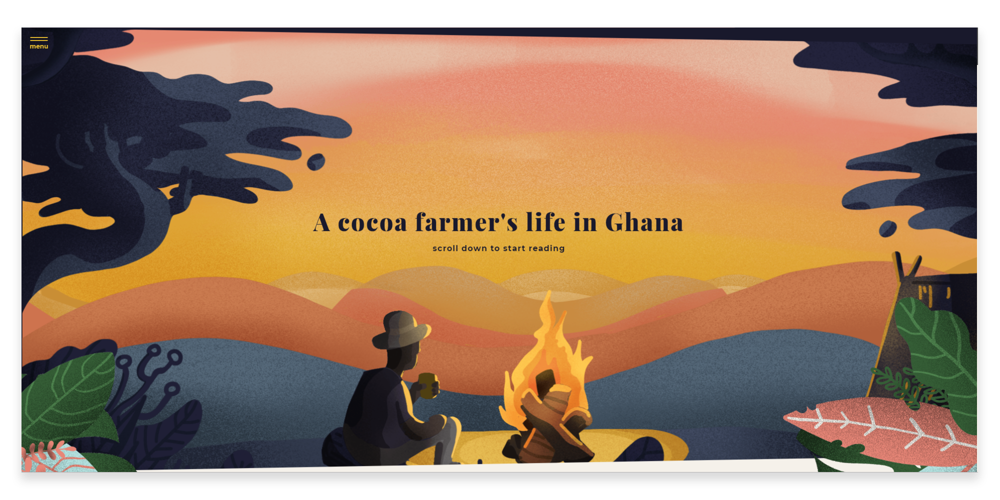
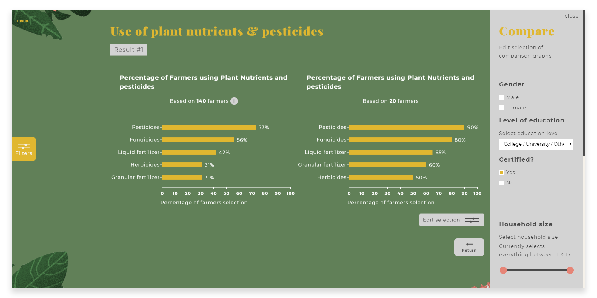

# RAUTZ - Story of Ghanaian cocoa farmers

## Summary
Interactive [vue](https://vuejs.org/) storytelling website which shows insights in the livelyhood of Ghanaian cocoa farmers.   
[check the live prototype here](https://rautz.netlify.com)

## Table of Contents
- [Install](#install)
- [Prototype](#prototype)
- [Process](#process)
  - [Concept](#concept)
  - [Code](#code-journey)
- [To do](#to-do)
- [Credits](#credits)
- [Sources](#sources)

## Install
```bash
# Install necessary packages
npm install

# Compiles and hot-reloads for development
npm run serve

# Compiles and minifies for production
npm run build
```

## Prototype
[check the live prototype here](https://rautz.netlify.com)



## Process
### Concept
The Amsterdam office of [UTZ](https://utz.org/) asked us to create an interactive product based on a dataset of Ghanaian Farmers by [KIT](https://kit.nl/). Their main envisioned goal was to end op with a product that showed insights in the lives of these farmers and ended with an income per family member.

The choices made in the design process can be read [here](https://paper.dropbox.com/doc/RAUTZ-Design-Rationale--AWN7V3rp4OwVb8dJBZT3OCinAg-k8FvG4Em2rRDUc5nbkd92).

### Code Journey
While the concept was taking shape and the first designs were created, I made a list of code features the live prototype should have. The designs showed lots of potential for reusable components. Furthermore, there were multiple forms and graphs in the designs that responded to eachother. This called for a way of state management. Both these aspects prompted me to choose for a javascript framework, namely [vue.js](https://vuejs.org/). I choose that particular one because I've done multiple projects with it already.   
Now that we had a framework to write the frontend of the website in, I had to make a decision about the graphs. I’ve looked at a couple of different ways to make graphs in js, namely [D3.js](https://d3js.org/) and [chart.js](https.chartjs.org). The difference between these two is that D3 works with SVG elements and chart.js works with canvas elements. I decided to go for D3, since this library allows for a lot of data editing, calculating and dynamic updating of data. Everytime the state changes in Vue, the D3 charts update with it, which adds a nice flow to the editing of the filters.

## To do
- [ ] Default select all filter options to prevent people from selecting a too small selection of farmers
- [ ] More testing to fix user experience issues
- [ ] Some more code cleanup

## Credits
- [Matthias Leuhof](https://github.com/MatthiasLeuhof) - Illustrations, data editing & concepting
- [Sam Hofman](https://github.com/labraksam) - UI Design & concepting
- [Angelique Janssen](https://github.com/angeliquejanssen) - UI Design & data editing

## Sources
### Dataset
- Bymolt, R., Laven, A., & Tyszler, M. (2018) [dataset]. Demystifying the cocoa sector in Ghana and Côte d’Ivoire. Retrieved from [https://doi.org/10.7910/DVN/82TWZJ](https://doi.org/10.7910/DVN/82TWZJ), Harvard Dataverse, V2
